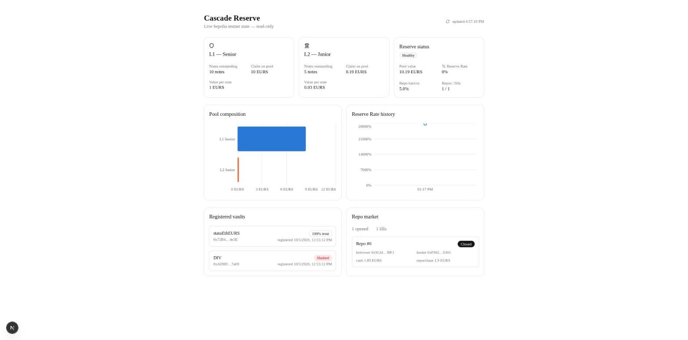

# Cascade Reserve

A tiered credit protocol with a repo market on top, combining two design
briefs:

- **The Cascade**: capital pools across registered ERC-4626 vaults. Any
  vault can register permissionlessly but starts at zero allocation
  weight, earning trust over an observation window from its own on-chain
  behavior. Depositors get one of two tiers of **Reserve Notes** — L1
  (senior, paid first) or L2 (junior, absorbs losses first) — and the
  ratio between them is a live, public "multiplier" reading.
- **The Reserve Repo Facility**: L1 notes can be posted as collateral for
  short-term cash, with a fixed repurchase price. The clearing rate across
  real fills becomes the **Reserve Rate**, a transaction-based benchmark
  (DeFi's answer to SOFR, not a formula or a survey).

Deployed and exercised end-to-end on Sepolia with verified contracts and
real transactions — no simulation, no mainnet. `dashboard/` is a read-only
Next.js viewer over the live deployment.

## What's real vs. simplified

**Real:**
- All 6 contracts deployed to Sepolia, verified on Etherscan.
- A genuine external vault integration: Aave V3's own `StaticATokenV3`
  wrapper, independently deployed (not a mock) — see "Design decisions"
  below for why Aave instead of Morpho Blue.
- A real loss scenario: a deliberately-drainable vault (`DemoInsolventVault`)
  registered, trusted, then drained, with the loss checkpointed
  permissionlessly and the waterfall absorbing it correctly on-chain.
- A real two-party repo: one account opens, a different account fills, the
  Reserve Rate is computed from that actual fill, and the repo was carried
  through to a real default (tenor expired unrepurchased, lender kept the
  note — no auction, no bot).
- 36 tests (unit + fuzz + invariant) across all four core contracts, all
  passing.

**Simplified / parameterized, not stubbed:**
- The observation window and repo tenor are configurable (10 minutes on
  Sepolia) instead of the suggested 90–180 days / 24 hours — a live chain
  can't be `vm.warp`'d, so these are scaled down to let the full lifecycle
  actually run in a demo session. The mechanism is identical at any
  duration; only the constant changes.
- The vault scoring function ("discovery engine") is a simple linear
  ramp from zero to full trust over the observation window, zeroed
  permanently on any observed loss — documented, not a stand-in for a
  more complex model that was cut for time.
- The Reserve Rate is a volume-weighted average of real fills in a
  trailing tenor-length window — genuinely transaction-based, but with no
  manipulation resistance (no volume floor, no multi-participant
  requirement). A thin market is easy to move; the brief flags this
  itself and explicitly scopes a production-grade resistant rate as out
  of scope.
- `roll()` (repo auto-rolling) is a borrower-callable function that
  atomically repurchases and reopens a cycle, not an off-chain keeper bot
  running it automatically. True zero-transaction automation was out of
  scope for this slice.

**Not built:**
- L3/L4 tiers (brief allows stopping at L1/L2).
- Full Morpho Blue integration (not deployed on any public testnet — see
  decision 7 below).
- ERC-7540 async deposit/redeem flows.
- Audits, mainnet deployment.

## Assumptions made for undefined terms

The source material references several terms from earlier, undocumented
discussion. Working definitions used throughout this codebase:

- **Discovery engine**: the vault-scoring function in `VaultRegistry` —
  a deterministic, on-chain, zero-human-input function of time-since-
  registration and observed loss events. See `decisions.md` #5.
- **The floor / countercyclical reserve**: a reserve ratio that builds up
  in calm periods and is released (not raised) under stress, implemented
  in `Cascade` (allocation sizing) and `RepoFacility` (haircuts can't rise
  while the Cascade is stressed).
- **Depth**: a Reserve Note's position in the loss-absorption order. Two
  depths exist here (L1 senior, L2 junior); L2 absorbs losses before L1
  by construction (`Cascade.seniorClaim()`/`juniorClaim()` — senior claim
  is capped at `min(pool, principal + accrued yield)`, junior gets the
  residual).
- **"Real environment" / "no simulation"**: read as a public testnet
  (Sepolia) with verified contracts and real transactions, not a mainnet
  deployment (reckless for an unaudited protocol) and not a mainnet fork
  (arguably still a simulation).

## Known risks and limitations

- **Reserve Rate manipulation**: with few participants, the clearing rate
  can be moved by a single large or wash-traded fill. No volume threshold,
  TWAP smoothing, or multi-participant requirement exists yet. Flagged as
  research-grade, not production-grade, by design.
- **Haircut-spiral risk**: repo is the mechanism Gorton & Metrick studied
  in 2008 — haircuts spiking in unison turns a credit event into a fire
  sale. The countercyclical floor extends to `RepoFacility`'s haircut
  explicitly (it can't be raised while the Cascade is stressed) to blunt
  this, but the facility still inherits the risk category itself.
- **Registration-blocks-on-deposit**: `VaultRegistry.register()` bundles
  the mandatory probation deposit into the same transaction as
  registration. If the target vault's own constraints (a supply cap, a
  pause) reject that deposit, registration itself fails — a real
  limitation hit during Sepolia deployment when Aave's own USDC/DAI/USDT
  markets turned out to be supply-capped (see `decisions.md` #10). In
  mild tension with "permissionless registration." Not fixed here; the
  fix would be decoupling registration from the first probation deposit
  into a separate, retryable step.
- **Morpho Blue dependency risk**: N/A to this deployment — Morpho Blue is
  not integrated (see decision 7), so its dependency risk never applies
  here. Noted because the original brief calls it out as "the one honest
  new risk" of the design it describes.

## Design decisions

Every non-obvious choice — tooling, deployment target, the non-rebasing
note design, vault scoring, the Aave-not-Morpho substitution, waterfall
computation, repo matching, the mid-deployment EURS asset switch — is
logged with its situation, the alternatives considered, and the reasoning
in **`decisions.md`**. Read it for the "why," not just the "what."

## Repo layout

```
src/                  VaultRegistry, Cascade, ReserveNote, RepoFacility,
                       DemoInsolventVault (the deliberate loss scenario)
test/unit/             one suite per contract
test/fuzz/              VaultRegistry scoring under randomized inputs
test/invariant/        Cascade waterfall safety, RepoFacility lifecycle
script/deploy/          Deploy.s.sol + Phase1-4 (the live Sepolia demo)
dashboard/              read-only Next.js viewer (its own README)
decisions.md            every design decision and why
docs/                   plan, progress, and session handoff notes
```

## Reproducing it

### Tests

```shell
forge test            # 36 tests: unit + fuzz + invariant
forge test -vvv        # with traces
```

### Deployment (Sepolia)

Needs a funded deployer keystore (`cast wallet import deployer --interactive`),
a Sepolia RPC URL, and an Etherscan API key. No private key is ever read
from an env var or file — every script signs via `--account <keystore>`.

```shell
forge script script/deploy/Deploy.s.sol:DeploySepolia \
  --rpc-url $SEPOLIA_RPC_URL --account deployer --broadcast --verify
```

Then fund the registry and run `Phase1_RegisterVaults.s.sol` through
`Phase4_LossAndDefault.s.sol` in order (each phase's own doc comment lists
its required env vars); wait out the observation window between Phase 1
and 2, and the repo tenor before Phase 4 if you want to exercise the
default path rather than a plain repurchase. `docs/handoff.md` has the
exact command sequence from the most recent live run, including the
faucet command for Sepolia EURS (the protocol's current asset — see
`decisions.md` #10 for why not USDC).

### Dashboard



```shell
cd dashboard
cp .env.local.example .env.local   # fill in the RPC URL + 6 contract addresses
npm install && npm run dev
```

See `dashboard/README.md` for what it reads and how.
